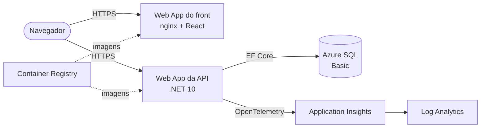

# DindinBuddies

Banco digital de exemplo: cadastro de clientes, abertura de contas e movimentações (depósito, saque e transferência), com extrato por período.

O projeto tem uma **API .NET 10**, um **front React** e um **script Bash** que cria todo o ambiente na **Azure**. Localmente, tudo sobe com **docker-compose**.

## Sumário

1. [Visão geral e arquitetura](#1-visão-geral-e-arquitetura)
2. [Pré-requisitos](#2-pré-requisitos)
3. [Rodar localmente com docker-compose](#3-rodar-localmente-com-docker-compose)
4. [Criar o ambiente na Azure](#4-criar-o-ambiente-na-azure)
5. [Acessar o front, a API e o Swagger](#5-acessar-o-front-a-api-e-o-swagger)
6. [Ver a telemetria no Application Insights](#6-ver-a-telemetria-no-application-insights)
7. [Remover tudo](#7-remover-tudo)

---

## 1. Visão geral e arquitetura

### Na Azure



| Recurso | Configuração |
| --- | --- |
| Azure SQL Database | Camada Basic. As tabelas são criadas pelas migrations do EF Core quando a API inicia. |
| App Service Plan | B1 Linux, com Always On. Hospeda os 2 Web Apps. |
| Web App da API | Container da API, com a connection string, o App Insights e o CORS configurados pelo script. |
| Web App do front | Container nginx servindo o React. A URL da API é gravada no build. |
| Container Registry | Camada Basic. Os Web Apps baixam as imagens com identidade gerenciada (AcrPull), sem senha. |
| Application Insights + Log Analytics | Telemetria da API: requisições, falhas, tempo de resposta e queries ao banco. |

### Código

```
DindinBuddies/
├─ api/                               API .NET 10 (Clean Architecture)
│  ├─ src/DindinBuddies.Domain/          entidades e regras de negócio
│  ├─ src/DindinBuddies.Application/     serviços (casos de uso), DTOs e interfaces
│  ├─ src/DindinBuddies.Infrastructure/  EF Core, migrations e repositórios
│  ├─ src/DindinBuddies.Api/             controllers, Swagger, CORS, App Insights
│  └─ tests/DindinBuddies.UnitTests/     xUnit + NSubstitute
├─ web/                               front React + Vite + TypeScript
├─ Scripts/deploy.sh                  criação do ambiente na Azure
├─ docker-compose.yml                 ambiente local completo
└─ .env.example                       modelo do .env local
```

### Banco de dados

Um **Cliente** tem várias **Contas**; uma **Conta** tem várias **Transações**. Uma transferência é um único registro, com a conta de origem (`ContaId`) e a de destino (`ContaDestinoId`).

- Nada é apagado em cascata. Conta encerrada vira `Ativa = 0`, e o histórico é mantido.
- O saldo fica gravado na conta e muda na mesma transação do banco que registra a movimentação.
- Datas são gravadas em UTC; o front mostra no horário local.

### Endpoints da API

Todos ficam sob `/api` e trocam JSON. Os enums trafegam como texto (`"Corrente"`, `"Poupanca"`, `"Deposito"`...). O Swagger (`/swagger`) documenta e permite testar cada um.

**Clientes**

| Método | Rota | Descrição | Respostas |
| --- | --- | --- | --- |
| GET | `/api/clientes?busca=` | Lista os clientes; `busca` (opcional) filtra por nome ou CPF | 200 |
| GET | `/api/clientes/{id}` | Busca um cliente | 200, 404 |
| POST | `/api/clientes` | Cadastra um cliente | 201, 400, 422 |
| PUT | `/api/clientes/{id}` | Edita nome, e-mail, telefone e nascimento (o CPF não muda) | 200, 400, 404, 422 |
| DELETE | `/api/clientes/{id}` | Exclui o cliente, só se ele não tiver contas | 204, 404, 422 |

**Contas**

| Método | Rota | Descrição | Respostas |
| --- | --- | --- | --- |
| GET | `/api/clientes/{id}/contas` | Lista as contas do cliente | 200, 404 |
| POST | `/api/clientes/{id}/contas` | Abre uma conta; agência (`0001`) e número sequencial são gerados pela API | 201, 400, 404 |
| GET | `/api/contas/{id}` | Busca uma conta | 200, 404 |
| GET | `/api/contas/busca?agencia=&numero=` | Busca pela agência e pelo número (ex.: `numero=42` encontra `000042`) | 200, 400, 404 |
| POST | `/api/contas/{id}/encerrar` | Encerra a conta, só com saldo zero | 200, 404, 422 |

**Movimentações**

| Método | Rota | Descrição | Respostas |
| --- | --- | --- | --- |
| POST | `/api/contas/{id}/depositos` | Deposita na conta | 200, 400, 404, 422 |
| POST | `/api/contas/{id}/saques` | Saca da conta | 200, 400, 404, 422 |
| POST | `/api/contas/{id}/transferencias` | Transfere para outra conta, em uma única transação do banco | 200, 400, 404, 422 |
| GET | `/api/contas/{id}/extrato?inicio=&fim=` | Extrato do período (datas em UTC, ISO 8601); sem datas, os últimos 30 dias | 200, 404, 422 |

Exemplos de corpo das requisições:

```jsonc
// POST /api/clientes
{ "nome": "Ana Souza", "cpf": "12345678901", "email": "ana@email.com", "telefone": "11 99999-0000", "dataNascimento": "1990-05-20" }

// POST /api/clientes/1/contas
{ "tipoConta": "Corrente" }

// POST /api/contas/1/depositos  (e /saques)
{ "valor": 150.75, "descricao": "Salário" }

// POST /api/contas/1/transferencias
{ "contaDestinoId": 2, "valor": 50, "descricao": "Almoço" }
```

As movimentações respondem com a transação criada e o `saldoAtual` da conta. No extrato, cada item traz o `sentido` (`Entrada` ou `Saida`) em relação à conta consultada.

### Principais regras

| Regra | Resposta da API |
| --- | --- |
| Saque ou transferência sem saldo | 422 |
| Movimentação em conta encerrada | 422 |
| Encerrar conta com saldo diferente de zero | 422 |
| Excluir cliente que tem contas | 422 |
| CPF ou e-mail já cadastrado | 422 |
| Dados inválidos (campos obrigatórios, CPF com 11 dígitos...) | 400 |
| Id inexistente | 404 |

Os erros seguem o formato **ProblemDetails**, com a mensagem em `detail` (ou em `errors`, no 400).

---

## 2. Pré-requisitos

| Para... | Você precisa de |
| --- | --- |
| Criar o ambiente na Azure | [Azure CLI](https://learn.microsoft.com/cli/azure/install-azure-cli) logado (`az login`) e um terminal Bash (Linux, macOS, WSL ou Git Bash no Windows) |
| Rodar localmente | [Docker Desktop](https://www.docker.com/products/docker-desktop/) (ou Docker Engine com o plugin compose) |
| Desenvolver sem Docker (opcional) | .NET SDK 10 e Node.js 22 |

> **Mac com chip Apple (M1 ou superior):** a imagem do SQL Server só existe para amd64. No Docker Desktop, ative **Settings → General → Use Rosetta for x86_64/amd64 emulation**.

> **Azure for Students:** essas assinaturas costumam bloquear o `az acr build`. O script detecta isso e gera as imagens com o **Docker local**; nesse caso, deixe o Docker em execução durante o deploy.

---

## 3. Rodar localmente com docker-compose

1. Na raiz do repositório, crie o `.env` a partir do modelo:

   ```bash
   cp .env.example .env
   ```

2. Edite o `.env` e defina `SQL_SA_PASSWORD`. A senha precisa ter 8 ou mais caracteres, com maiúsculas, minúsculas, números e símbolos, sem `;` nem aspas.

3. Suba o ambiente:

   ```bash
   docker compose up --build
   ```

4. Acesse:

   | O quê | Endereço |
   | --- | --- |
   | Front | http://localhost:3000 |
   | API (Swagger) | http://localhost:5000/swagger |
   | SQL Server | `localhost,1433`, usuário `sa`, senha do `.env` |

Na primeira subida, a API espera o SQL Server ficar pronto e cria as tabelas sozinha.

| Comando | Efeito |
| --- | --- |
| `docker compose down` | Para tudo e **mantém** os dados (volume `sqlserver-dados`) |
| `docker compose down -v` | Para tudo e **apaga** os dados |

### Testes e desenvolvimento sem Docker

```bash
cd api && dotnet test
```

Para rodar a API fora do Docker, defina a connection string em `ConnectionStrings__DindinBuddies` e use `dotnet run --project src/DindinBuddies.Api` (Swagger em http://localhost:5238/swagger). O front roda com `npm install` e `npm run dev` dentro de `web/` (http://localhost:5173) e chama a API em http://localhost:5238.

---

## 4. Criar o ambiente na Azure

O script `Scripts/deploy.sh` cria tudo com o Azure CLI. Cada etapa é um bloco separado no script.

### Passo a passo

1. Faça login e, se tiver mais de uma assinatura, escolha a certa:

   ```bash
   az login
   az account set --subscription "<nome ou id da assinatura>"
   ```

2. Na raiz do repositório, rode o script:

   ```bash
   ./Scripts/deploy.sh
   ```

   Se der "permissão negada", use `bash Scripts/deploy.sh`.

3. Informe a **senha do administrador do SQL** quando ela for pedida. Para não digitar, defina antes a variável `SQL_ADMIN_PASSWORD`. A senha nunca é gravada no repositório.

4. Aguarde. A primeira execução leva de 10 a 20 minutos. O script mostra o andamento:

   | Etapa | O que faz |
   | --- | --- |
   | 1/8 Verificações | Confere o Azure CLI, o login, a região e os provedores de recursos; instala a extensão `application-insights` do CLI |
   | 2/8 Resource Group | `rg-dindinbuddies` |
   | 3/8 Azure SQL | Servidor, banco Basic e firewall liberando os serviços da Azure |
   | 4/8 Monitoramento | Log Analytics e Application Insights |
   | 5/8 Container Registry | ACR Basic e build da imagem da API |
   | 6/8 Web Apps | Plano B1 Linux, Web App da API, build da imagem do front (com a URL da API) e Web App do front |
   | 7/8 Configuração | Connection string, App Insights e CORS na API; reinício dos Web Apps |
   | 8/8 Saída | Espera a API responder e imprime as URLs |

### Opções

| Variável | Padrão | Uso |
| --- | --- | --- |
| `REGIAO` | `chilecentral` | Região da Azure |
| `SQL_ADMIN_PASSWORD` | (pedida na execução) | Senha do administrador do SQL (`dindinadmin`) |
| `SUFIXO` | aleatório | Sufixo dos nomes globais (SQL, ACR, Web Apps) |

Os nomes globais ganham um sufixo aleatório, mostrado no fim. Para **atualizar** o mesmo ambiente (por exemplo, publicar uma nova versão do código), rode de novo informando o sufixo:

```bash
SUFIXO=<sufixo> ./Scripts/deploy.sh
```

### Custos

Enquanto os recursos existirem, o custo aproximado é de US$ 25 por mês (App Service B1, SQL Basic e ACR Basic, mais o uso do Log Analytics). Remova o ambiente quando não precisar mais dele (seção 7).

---

## 5. Acessar o front, a API e o Swagger

No fim, o script imprime as três URLs:

```
  Front:    https://app-dindinbuddies-web-<sufixo>.azurewebsites.net
  API:      https://app-dindinbuddies-api-<sufixo>.azurewebsites.net
  Swagger:  https://app-dindinbuddies-api-<sufixo>.azurewebsites.net/swagger
```

- **Front:** cadastre um cliente, abra contas e faça depósitos, saques e transferências. Na transferência, informe o número da conta de destino (ex.: `000002`).
- **Swagger:** documenta e permite testar todos os endpoints. A raiz da API também redireciona para ele.

Se a página abrir com erro logo após o deploy, aguarde alguns minutos: na primeira vez, o App Service baixa as imagens e a API cria as tabelas. Para acompanhar:

```bash
az webapp log tail -g rg-dindinbuddies -n app-dindinbuddies-api-<sufixo>
```

---

## 6. Ver a telemetria no Application Insights

Só a API envia telemetria (pacote Azure Monitor OpenTelemetry). Ela registra requisições, falhas, tempo de resposta e as queries ao SQL sem código extra. Localmente, sem a variável `APPLICATIONINSIGHTS_CONNECTION_STRING`, a telemetria fica desligada.

1. No [portal da Azure](https://portal.azure.com), abra o Resource Group **rg-dindinbuddies** e depois o recurso **appi-dindinbuddies**.
2. Use as telas:

   | Tela | O que mostra |
   | --- | --- |
   | **Live metrics** | Requisições e falhas em tempo real (use o front enquanto olha) |
   | **Application map** | API → Azure SQL, com volume de chamadas e tempo médio |
   | **Performance** | Tempo de resposta por endpoint e as queries mais lentas |
   | **Failures** | Erros 5xx e exceções, com o detalhe de cada uma |
   | **Transaction search** | Uma requisição de ponta a ponta, incluindo as queries ao banco |

3. Em **Logs**, é possível consultar com KQL. Exemplos:

   ```kusto
   // Requisições por endpoint na última hora
   requests
   | where timestamp > ago(1h)
   | summarize total = count(), media_ms = avg(duration) by name, resultCode
   | order by total desc
   ```

   ```kusto
   // Queries ao SQL mais lentas
   dependencies
   | where type == "SQL"
   | top 20 by duration desc
   ```

Os dados levam de 1 a 3 minutos para aparecer (exceto no Live metrics, que é imediato).

---

## 7. Remover tudo

Todos os recursos ficam no mesmo Resource Group. Para remover tudo (e parar a cobrança):

```bash
az group delete -n rg-dindinbuddies --yes --no-wait
```

A exclusão leva alguns minutos. Para acompanhar:

```bash
az group exists -n rg-dindinbuddies
```

Quando o comando retornar `false`, o ambiente foi removido.
