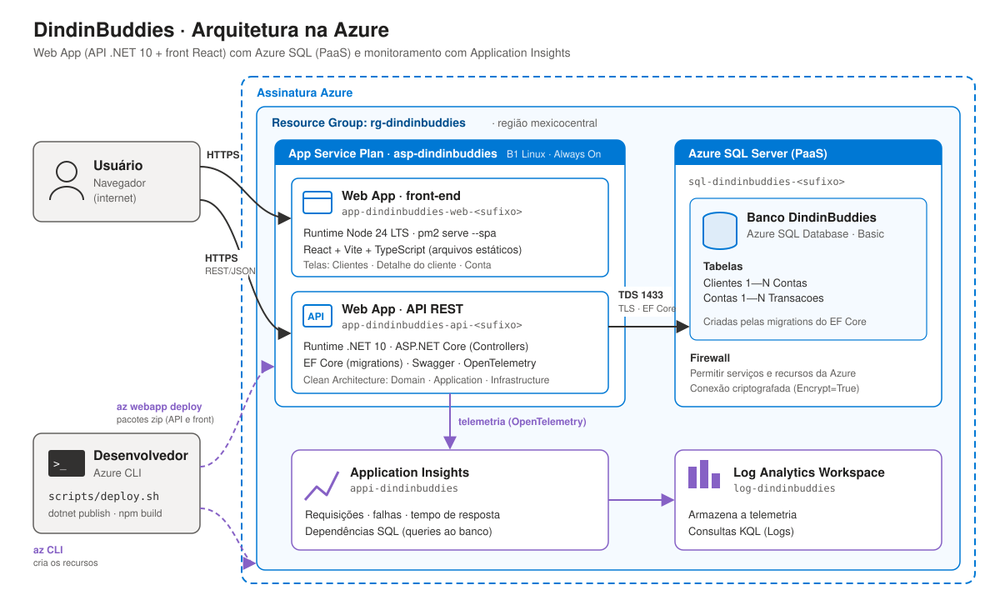
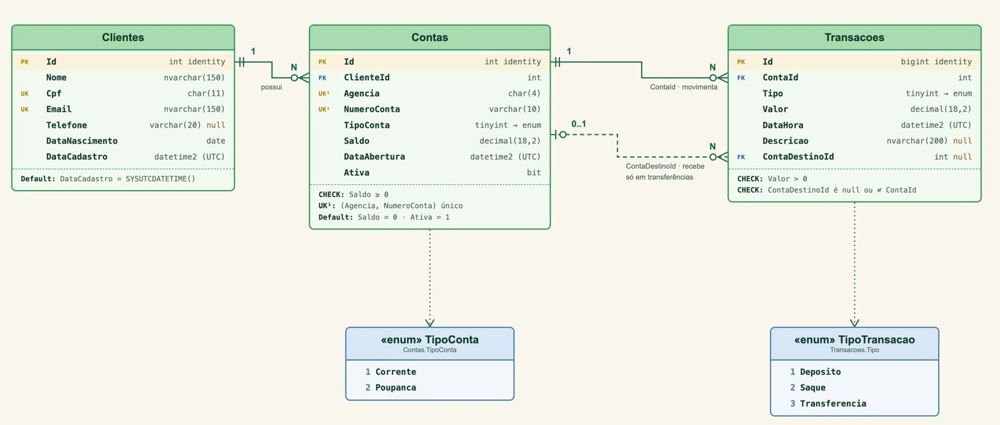

# DindinBuddies - CP5 - DevOps Tools & Cloud Computing

Banco digital de exemplo do projeto **DimdimBuddies**: Cadastro de clientes, Abertura de contas e Movimentações (depósito, saque e transferência), com Extrato por período.


| **Vídeo da solução** | link_do_vídeo |
| --- | --- |

---

## Integrantes do Grupo

| Nome | RM | Turma |
|------|-----|-------|
| Felipe Yuiti Ishii | 565339 | 2TDS Fevereiro |
| Gabriel Nogueira Peixoto | 563925 | 2TDS Fevereiro |
| Giovanna Neri dos Santos | 566154 | 2TDS Fevereiro |
| Mariana Inoue | 565834 | 2TDS Fevereiro |


## Sumário

1. [Descrição da solução](#1-descrição-da-solução)
2. [Arquitetura](#2-arquitetura)
3. [Banco de dados](#3-banco-de-dados)
4. [API: endpoints e JSON das operações](#4-api-endpoints-e-json-das-operações)
5. [Pré-requisitos](#5-pré-requisitos)
6. [Rodar localmente com docker-compose](#6-rodar-localmente-com-docker-compose)
7. [How to: criar o ambiente na Azure](#7-how-to-criar-o-ambiente-na-azure)
8. [Acessar o front, a API e o Swagger](#8-acessar-o-front-a-api-e-o-swagger)
9. [Monitoramento com Application Insights](#9-monitoramento-com-application-insights)
10. [Remover tudo](#10-remover-tudo)

---

## 1. Descrição da solução

O **DindinBuddies** é uma aplicação web de banco digital para o estudo de caso Dimdim. Ela permite:

- **Clientes:** cadastrar, buscar por nome ou CPF, editar e excluir.
- **Contas:** abrir contas Corrente ou Poupança (agência e número gerados automaticamente), alterar o tipo, encerrar e excluir.
- **Movimentações:** depositar, sacar e transferir entre contas, com o saldo sempre consistente (nunca negativo).
- **Extrato:** consultar as movimentações por período, com entradas e saídas destacadas; editar a descrição de uma transação ou estorná-la.

| Camada | Tecnologia |
| --- | --- |
| Front-end | React + Vite + TypeScript, Tailwind CSS + shadcn/ui, TanStack Query e Axios |
| API | .NET 10 (ASP.NET Core com Controllers), Clean Architecture, EF Core, Swagger |
| Banco de dados | **Azure SQL Database** (PaaS), tabelas criadas pelas migrations do EF Core |
| Hospedagem | **Azure App Service** (Web Apps Linux) |
| Deploy | **Azure CLI + `az webapp deploy`** (script `scripts/deploy.sh`) |
| Monitoramento | **Application Insights** + Log Analytics (OpenTelemetry na API) |
| Testes | xUnit v3 + NSubstitute (regras de negócio e casos de uso) |

O front e a API são publicados em Web Apps separados. A API persiste os dados no Azure SQL e envia telemetria ao Application Insights. Para rodar localmente, um `docker-compose` sobe tudo com um SQL Server em container (o Docker é usado **só localmente**; na Azure não há containers).

---

## 2. Arquitetura



| Recurso Azure | Nome | Configuração |
| --- | --- | --- |
| Resource Group | `rg-dindinbuddies` | Região `chilecentral` |
| App Service Plan | `asp-dindinbuddies` | B1 Linux, Always On |
| Web App (API) | `app-dindinbuddies-api-<sufixo>` | Runtime `DOTNETCORE:10.0`, só HTTPS; connection string, Application Insights e CORS configurados pelo script |
| Web App (front) | `app-dindinbuddies-web-<sufixo>` | Runtime `NODE:24-lts`, só HTTPS; serve o build do React com `pm2 serve --spa` |
| Azure SQL Server | `sql-dindinbuddies-<sufixo>` | Firewall liberando os serviços da Azure |
| Azure SQL Database | `DindinBuddies` | Camada Basic |
| Application Insights | `appi-dindinbuddies` | Ligado ao Log Analytics |
| Log Analytics Workspace | `log-dindinbuddies` | Armazena a telemetria |

### Organização do código

```
DindinBuddies/
├─ api/                                  API .NET 10 (Clean Architecture)
│  ├─ src/DindinBuddies.Domain/             entidades e regras de negócio
│  ├─ src/DindinBuddies.Application/        serviços (casos de uso), DTOs e interfaces
│  ├─ src/DindinBuddies.Infrastructure/     EF Core, migrations e repositórios
│  ├─ src/DindinBuddies.Api/                controllers, Swagger, CORS, App Insights
│  └─ tests/DindinBuddies.UnitTests/        xUnit v3 + NSubstitute
├─ web/                                  front React + Vite + TypeScript
├─ scripts/
│  ├─ deploy.sh                          Azure CLI: cria o ambiente e faz o deploy
│  ├─ deploy.env.example                 configuração do deploy (copie para deploy.env)
│  ├─ ddl.sql                            DDL das tabelas
│  ├─ consultas.sql                      consultas para conferir os dados no banco
│  └─ DindinBuddies.postman_collection.json   coleção com todas as operações
├─ docs/arquitetura.svg                  desenho da arquitetura
├─ docker-compose.yml                    ambiente local (SQL Server + API + front)
└─ .env.example                          modelo do .env local
```

---

## 3. Banco de dados

Três tabelas com relacionamento: um **Cliente** tem várias **Contas**; uma **Conta** tem várias **Transações**. Uma transferência é um único registro, com a conta de origem (`ContaId`) e a de destino (`ContaDestinoId`).



| Tabela | Colunas |
| --- | --- |
| **Clientes** | `Id` (PK), `Nome`, `Cpf` (único), `Email` (único), `Telefone`, `DataNascimento`, `DataCadastro` |
| **Contas** | `Id` (PK), `ClienteId` (FK), `Agencia`, `NumeroConta` (único com a agência), `TipoConta` (1 Corrente, 2 Poupança), `Saldo` (≥ 0), `DataAbertura`, `Ativa` |
| **Transacoes** | `Id` (PK), `ContaId` (FK), `Tipo` (1 Depósito, 2 Saque, 3 Transferência), `Valor` (> 0), `DataHora`, `Descricao`, `ContaDestinoId` (FK) |

- **DDL completo:** [`scripts/ddl.sql`](scripts/ddl.sql). Não é preciso executá-lo: a API aplica a migration do EF Core e cria as tabelas sozinha ao iniciar.
- **Consultas para conferir os dados:** [`scripts/consultas.sql`](scripts/consultas.sql).
- Nada é apagado em cascata. Conta encerrada vira `Ativa = 0` e mantém o histórico; só contas sem movimentações podem ser excluídas.
- Excluir uma transação é um **estorno**: o saldo das contas envolvidas volta ao que era antes.
- O saldo fica gravado na conta e muda na mesma transação do banco que registra a movimentação. Datas são gravadas em UTC.

---

## 4. API: endpoints e JSON das operações

Todos os endpoints ficam sob `/api` e trocam JSON. Os enums trafegam como texto (`"Corrente"`, `"Poupanca"`, `"Deposito"`...). O **Swagger** (`/swagger`) documenta e permite testar cada um.

A coleção [`scripts/DindinBuddies.postman_collection.json`](scripts/DindinBuddies.postman_collection.json) tem **todas as operações**: importe no Postman, ajuste a variável `baseUrl` (ex.: `https://app-dindinbuddies-api-<sufixo>.azurewebsites.net`) e use **Run collection** para executar o CRUD completo em ordem.

### Endpoints

**Clientes**

| Método | Rota | Descrição | Respostas |
| --- | --- | --- | --- |
| GET | `/api/clientes?busca=` | Lista os clientes; `busca` (opcional) filtra por nome ou CPF | 200 |
| GET | `/api/clientes/{id}` | Busca um cliente | 200, 404 |
| POST | `/api/clientes` | Cadastra um cliente | 201, 400, 422 |
| PUT | `/api/clientes/{id}` | Edita nome, e-mail, telefone e nascimento (o CPF não muda) | 200, 400, 404, 422 |
| DELETE | `/api/clientes/{id}` | Exclui o cliente, só se ele não tiver contas | 204, 404, 422 |

**Contas**

| Método | Rota | Descrição | Respostas |
| --- | --- | --- | --- |
| GET | `/api/clientes/{id}/contas` | Lista as contas do cliente | 200, 404 |
| POST | `/api/clientes/{id}/contas` | Abre uma conta; agência (`0001`) e número sequencial são gerados pela API | 201, 400, 404 |
| GET | `/api/contas/{id}` | Busca uma conta | 200, 404 |
| GET | `/api/contas/busca?agencia=&numero=` | Busca pela agência e pelo número (ex.: `numero=42` encontra `000042`) | 200, 400, 404 |
| PUT | `/api/contas/{id}` | Altera o tipo da conta (agência, número e saldo não mudam) | 200, 400, 404, 422 |
| POST | `/api/contas/{id}/encerrar` | Encerra a conta, só com saldo zero | 200, 404, 422 |
| DELETE | `/api/contas/{id}` | Exclui a conta, só se ela não tiver movimentações (senão, encerre) | 204, 404, 422 |

**Movimentações**

| Método | Rota | Descrição | Respostas |
| --- | --- | --- | --- |
| POST | `/api/contas/{id}/depositos` | Deposita na conta | 200, 400, 404, 422 |
| POST | `/api/contas/{id}/saques` | Saca da conta | 200, 400, 404, 422 |
| POST | `/api/contas/{id}/transferencias` | Transfere para outra conta, em uma única transação do banco | 200, 400, 404, 422 |
| GET | `/api/contas/{id}/extrato?inicio=&fim=` | Extrato do período (datas em UTC, ISO 8601); sem datas, os últimos 30 dias | 200, 404, 422 |

**Transações**

| Método | Rota | Descrição | Respostas |
| --- | --- | --- | --- |
| GET | `/api/transacoes/{id}` | Busca uma transação | 200, 404 |
| PUT | `/api/transacoes/{id}` | Edita a descrição (valor, tipo e contas não mudam) | 200, 400, 404 |
| DELETE | `/api/transacoes/{id}` | Exclui com **estorno**: desfaz o efeito no saldo das contas envolvidas | 204, 404, 422 |

As transações são criadas pelas movimentações (depósito, saque e transferência).

### JSON das operações

Exemplos reais de requisição e resposta. Os ids e datas variam a cada execução.

<details open>
<summary><b>Clientes</b>: POST, GET, PUT e DELETE</summary>

**POST** `/api/clientes` → `201 Created`

```json
{
  "nome": "Carla Mendes",
  "cpf": "52998224725",
  "email": "carla@email.com",
  "telefone": "11 97777-6666",
  "dataNascimento": "1995-08-14"
}
```

```json
{
  "id": 1,
  "nome": "Carla Mendes",
  "cpf": "52998224725",
  "email": "carla@email.com",
  "telefone": "11 97777-6666",
  "dataNascimento": "1995-08-14",
  "dataCadastro": "2026-10-05T00:06:14.1455212Z"
}
```

**GET** `/api/clientes/1` → `200 OK` (mesmo formato da resposta acima). `GET /api/clientes?busca=Carla` devolve uma lista nesse formato.

**PUT** `/api/clientes/1` → `200 OK`

```json
{
  "nome": "Carla Mendes Rocha",
  "email": "carla.rocha@email.com",
  "telefone": "11 97777-6666",
  "dataNascimento": "1995-08-14"
}
```

```json
{
  "id": 1,
  "nome": "Carla Mendes Rocha",
  "cpf": "52998224725",
  "email": "carla.rocha@email.com",
  "telefone": "11 97777-6666",
  "dataNascimento": "1995-08-14",
  "dataCadastro": "2026-10-05T00:06:14.1455212Z"
}
```

**DELETE** `/api/clientes/1` → `204 No Content` (sem corpo). Se o cliente tiver contas → `422`:

```json
{
  "type": "https://tools.ietf.org/html/rfc4918#section-11.2",
  "title": "Regra de negócio violada",
  "status": 422,
  "detail": "O cliente possui contas e não pode ser excluído."
}
```

</details>

<details>
<summary><b>Contas</b>: POST, GET, PUT e DELETE</summary>

**POST** `/api/clientes/1/contas` → `201 Created`

```json
{ "tipoConta": "Corrente" }
```

```json
{
  "id": 1,
  "clienteId": 1,
  "agencia": "0001",
  "numeroConta": "000001",
  "tipoConta": "Corrente",
  "saldo": 0.00,
  "dataAbertura": "2026-10-05T00:06:15.4394942Z",
  "ativa": true
}
```

**GET** `/api/contas/1` → `200 OK` (mesmo formato). Também: `GET /api/clientes/1/contas` (lista) e `GET /api/contas/busca?agencia=0001&numero=1`.

**PUT** `/api/contas/1` → `200 OK`

```json
{ "tipoConta": "Poupanca" }
```

```json
{
  "id": 1,
  "clienteId": 1,
  "agencia": "0001",
  "numeroConta": "000001",
  "tipoConta": "Poupanca",
  "saldo": 0.00,
  "dataAbertura": "2026-10-05T00:06:15.4394942Z",
  "ativa": true
}
```

**POST** `/api/contas/1/encerrar` → `200 OK` (a conta volta com `"ativa": false`).

**DELETE** `/api/contas/1` → `204 No Content`. Se a conta tiver movimentações → `422`:

```json
{
  "type": "https://tools.ietf.org/html/rfc4918#section-11.2",
  "title": "Regra de negócio violada",
  "status": 422,
  "detail": "A conta possui movimentações e não pode ser excluída. Encerre a conta."
}
```

</details>

<details>
<summary><b>Movimentações</b>: depósito, saque, transferência e extrato</summary>

**POST** `/api/contas/1/depositos` → `200 OK` (o saque, em `/saques`, usa o mesmo formato)

```json
{ "valor": 1500.00, "descricao": "Salário" }
```

```json
{
  "transacaoId": 1,
  "tipo": "Deposito",
  "valor": 1500.00,
  "dataHora": "2026-10-05T00:06:17.0715696Z",
  "descricao": "Salário",
  "contaDestinoId": null,
  "saldoAtual": 1500.00
}
```

**POST** `/api/contas/1/transferencias` → `200 OK`

```json
{ "contaDestinoId": 2, "valor": 300.00, "descricao": "Reserva" }
```

```json
{
  "transacaoId": 3,
  "tipo": "Transferencia",
  "valor": 300.00,
  "dataHora": "2026-10-05T00:06:17.6656428Z",
  "descricao": "Reserva",
  "contaDestinoId": 2,
  "saldoAtual": 1079.50
}
```

Saque sem saldo → `422`:

```json
{
  "type": "https://tools.ietf.org/html/rfc4918#section-11.2",
  "title": "Regra de negócio violada",
  "status": 422,
  "detail": "Saldo insuficiente."
}
```

**GET** `/api/contas/1/extrato?inicio=2026-10-01T00:00:00Z&fim=2026-10-31T23:59:59Z` → `200 OK`

```json
{
  "contaId": 1,
  "saldoAtual": 1079.50,
  "inicio": "2026-10-01T00:00:00Z",
  "fim": "2026-10-31T23:59:59Z",
  "itens": [
    {
      "transacaoId": 3,
      "tipo": "Transferencia",
      "sentido": "Saida",
      "valor": 300.00,
      "dataHora": "2026-10-05T00:06:17.6656428Z",
      "descricao": "Reserva",
      "contaOrigemId": 1,
      "contaDestinoId": 2
    },
    {
      "transacaoId": 2,
      "tipo": "Saque",
      "sentido": "Saida",
      "valor": 120.50,
      "dataHora": "2026-10-05T00:06:17.2648102Z",
      "descricao": "Mercado",
      "contaOrigemId": 1,
      "contaDestinoId": null
    },
    {
      "transacaoId": 1,
      "tipo": "Deposito",
      "sentido": "Entrada",
      "valor": 1500.00,
      "dataHora": "2026-10-05T00:06:17.0715696Z",
      "descricao": "Salário",
      "contaOrigemId": 1,
      "contaDestinoId": null
    }
  ]
}
```

</details>

<details>
<summary><b>Transações</b>: GET, PUT e DELETE</summary>

**GET** `/api/transacoes/2` → `200 OK`

```json
{
  "id": 2,
  "contaId": 1,
  "tipo": "Saque",
  "valor": 120.50,
  "dataHora": "2026-10-05T00:06:17.2648102Z",
  "descricao": "Mercado",
  "contaDestinoId": null
}
```

**PUT** `/api/transacoes/2` → `200 OK` (só a descrição muda)

```json
{ "descricao": "Mercado do mês" }
```

```json
{
  "id": 2,
  "contaId": 1,
  "tipo": "Saque",
  "valor": 120.50,
  "dataHora": "2026-10-05T00:06:17.2648102Z",
  "descricao": "Mercado do mês",
  "contaDestinoId": null
}
```

**DELETE** `/api/transacoes/2` → `204 No Content`. O saque é estornado: os R$ 120,50 voltam para a conta e a transação é excluída. Se o estorno deixar algum saldo negativo (ex.: estornar um depósito que já foi gasto) → `422`.

</details>

### Erros

| Situação | Resposta |
| --- | --- |
| Saque ou transferência sem saldo; movimentação em conta encerrada | 422 |
| Encerrar conta com saldo; excluir conta com movimentações; excluir cliente com contas | 422 |
| Estorno que deixaria saldo negativo ou envolve conta encerrada | 422 |
| CPF ou e-mail já cadastrado | 422 |
| Dados inválidos (campos obrigatórios, CPF com 11 dígitos...) | 400, com as mensagens em `errors` |
| Id inexistente | 404 |

Os erros seguem o formato **ProblemDetails**, com a mensagem em `detail`.

---

## 5. Pré-requisitos

| Para... | Você precisa de |
| --- | --- |
| Criar o ambiente na Azure | [Azure CLI](https://learn.microsoft.com/cli/azure/install-azure-cli) logado (`az login`), [.NET SDK 10](https://dotnet.microsoft.com/download), [Node.js 22+](https://nodejs.org) com npm, Python 3 ou o comando `zip` (para gerar os pacotes) e um terminal Bash (Linux, macOS, WSL ou Git Bash no Windows) |
| Rodar localmente | [Docker Desktop](https://www.docker.com/products/docker-desktop/) (ou Docker Engine com o plugin compose) |
| Desenvolver sem Docker (opcional) | .NET SDK 10 e Node.js 22+ |

> **Docker não é necessário para o deploy:** na Azure não há containers. O script gera os pacotes na sua máquina (`dotnet publish` e `npm run build`) e os publica com `az webapp deploy`.

> **Mac com chip Apple (M1 ou superior):** para rodar localmente, a imagem do SQL Server só existe para amd64. No Docker Desktop, ative **Settings → General → Use Rosetta for x86_64/amd64 emulation**.

---

## 6. Rodar localmente com docker-compose

1. Na raiz do repositório, crie o `.env` a partir do modelo:

   ```bash
   cp .env.example .env
   ```

2. Edite o `.env` e defina `SQL_SA_PASSWORD`. A senha precisa ter 8 ou mais caracteres, com maiúsculas, minúsculas, números e símbolos, sem `;` nem aspas.

3. Suba o ambiente:

   ```bash
   docker compose up --build
   ```

4. Acesse:

   | O quê | Endereço |
   | --- | --- |
   | Front | http://localhost:3000 |
   | API (Swagger) | http://localhost:5000/swagger |
   | SQL Server | `localhost,1433`, usuário `sa`, senha do `.env` |

Na primeira subida, a API espera o SQL Server ficar pronto e cria as tabelas sozinha. O compose usa o volume `sqlserver-dados` (dados do banco) e a rede `dindinbuddies-rede` (ligando os três serviços).

| Comando | Efeito |
| --- | --- |
| `docker compose down` | Para tudo e **mantém** os dados |
| `docker compose down -v` | Para tudo e **apaga** os dados |

### Testes e desenvolvimento sem Docker

```bash
cd api && dotnet test
```

Para rodar a API fora do Docker, defina a connection string em `ConnectionStrings__DindinBuddies` e use `dotnet run --project src/DindinBuddies.Api` (Swagger em http://localhost:5238/swagger). O front roda com `npm install` e `npm run dev` dentro de `web/` (http://localhost:5173) e chama a API em http://localhost:5238.

---

## 7. How to: criar o ambiente na Azure

O script [`scripts/deploy.sh`](scripts/deploy.sh) cria todos os recursos com o **Azure CLI** e publica a API e o front com **`az webapp deploy`** (pacotes zip). Cada etapa é um bloco separado no script.

### Passo a passo

1. Clone o repositório e entre na pasta:

   ```bash
   git clone https://github.com/3BugBuddies/DindinBuddies-Devops-CP5.git
   cd DindinBuddies-Devops-CP5
   ```

2. Faça login e, se tiver mais de uma assinatura, escolha a certa:

   ```bash
   az login
   az account set --subscription "<nome ou id da assinatura>"
   ```

3. Crie o seu arquivo de configuração a partir do modelo e preencha os valores:

   ```bash
   cp scripts/deploy.env.example scripts/deploy.env
   ```

   O `scripts/deploy.env` fica **fora do Git** (ele pode conter a senha do SQL). Todos os campos são opcionais; o que ficar vazio usa o padrão:

   | Campo | Padrão | Uso |
   | --- | --- | --- |
   | `ASSINATURA` | assinatura atual do Azure CLI | Nome ou id da assinatura (`az account list -o table`) |
   | `REGIAO` | `chilecentral` | Região dos recursos |
   | `GRUPO` | `rg-dindinbuddies` | Nome do Resource Group |
   | `SUFIXO` | gerado e gravado no arquivo | Sufixo dos nomes globais (servidor SQL e Web Apps) |
   | `SQL_ADMIN_USER` | `dindinadmin` | Usuário administrador do Azure SQL |
   | `SQL_ADMIN_PASSWORD` | pedida na execução | Senha do administrador (8+ caracteres, com 3 destes grupos: maiúsculas, minúsculas, números e símbolos; sem `;` nem aspas) |

   > Sem o `deploy.env`, o script também funciona: usa os padrões e pede a senha na hora.

4. Rode o script na raiz do repositório:

   ```bash
   ./scripts/deploy.sh
   ```

   Se der "permissão negada", use `bash scripts/deploy.sh`.

5. Aguarde. A primeira execução leva de 10 a 20 minutos. O script mostra o andamento:

   | Etapa | O que faz |
   | --- | --- |
   | 1/9 Verificações | Confere o Azure CLI e o login, o .NET SDK, o Node, a ferramenta de zip, a região e os provedores de recursos; instala a extensão `application-insights` do CLI |
   | 2/9 Resource Group | `rg-dindinbuddies` |
   | 3/9 Azure SQL | Servidor, banco Basic e firewall liberando os serviços da Azure |
   | 4/9 Monitoramento | Log Analytics e Application Insights |
   | 5/9 Web Apps | Plano B1 Linux e os Web Apps da API (`DOTNETCORE:10.0`) e do front (`NODE:24-lts`), com Always On e só HTTPS |
   | 6/9 Configuração | Connection string, Application Insights e CORS na API |
   | 7/9 Deploy da API | `dotnet publish`, zip e `az webapp deploy` |
   | 8/9 Deploy do front | `npm run build` com a URL da API, zip e `az webapp deploy` |
   | 9/9 Saída | Espera a API responder e imprime as URLs |

### Atualizar o ambiente

Para **republicar** nos mesmos recursos (por exemplo, depois de mudar o código), basta rodar o script de novo: o sufixo gerado na primeira execução fica gravado no `scripts/deploy.env`.

```bash
./scripts/deploy.sh
```

Os campos também podem ser passados como variáveis de ambiente, que têm prioridade sobre o arquivo (ex.: `SUFIXO=abc12 ./scripts/deploy.sh`). Sem o `deploy.env`, guarde o sufixo mostrado no fim da execução e use-o assim para atualizar o mesmo ambiente.

---

## 8. Acessar o front, a API e o Swagger

No fim, o script imprime as três URLs:

```
  Front:    https://app-dindinbuddies-web-<sufixo>.azurewebsites.net
  API:      https://app-dindinbuddies-api-<sufixo>.azurewebsites.net
  Swagger:  https://app-dindinbuddies-api-<sufixo>.azurewebsites.net/swagger
```

- **Front:** cadastre um cliente, abra contas e faça depósitos, saques e transferências. Na transferência, informe o número da conta de destino (ex.: `000002`).
- **Swagger:** documenta e permite testar todos os endpoints. A raiz da API também redireciona para ele.

Se a página abrir com erro logo após o deploy, aguarde alguns minutos: na primeira vez, o App Service inicia as aplicações e a API cria as tabelas. Para acompanhar:

```bash
az webapp log tail -g rg-dindinbuddies -n app-dindinbuddies-api-<sufixo>
```

---

## 9. Monitoramento com Application Insights

A API envia telemetria pelo pacote Azure Monitor OpenTelemetry: requisições, falhas, tempo de resposta e as **queries ao Azure SQL** (dependências), sem código extra. Localmente, sem a variável `APPLICATIONINSIGHTS_CONNECTION_STRING`, a telemetria fica desligada.

1. No [portal da Azure](https://portal.azure.com), abra o Resource Group **rg-dindinbuddies** e depois o recurso **appi-dindinbuddies**.
2. Use as telas:

   | Tela | O que mostra |
   | --- | --- |
   | **Live metrics** | Requisições e falhas em tempo real (use o front enquanto olha) |
   | **Application map** | API → Azure SQL, com volume de chamadas e tempo médio |
   | **Performance** | Tempo de resposta por endpoint e as queries mais lentas |
   | **Failures** | Erros 5xx e exceções, com o detalhe de cada uma |
   | **Transaction search** | Uma requisição de ponta a ponta, incluindo as queries ao banco |

3. Em **Logs**, é possível consultar com KQL. Exemplos:

   ```kusto
   // Requisições por endpoint na última hora
   requests
   | where timestamp > ago(1h)
   | summarize total = count(), media_ms = avg(duration) by name, resultCode
   | order by total desc
   ```

   ```kusto
   // Queries ao SQL mais lentas
   dependencies
   | where type == "SQL"
   | top 20 by duration desc
   ```

Os dados levam de 1 a 3 minutos para aparecer (exceto no Live metrics, que é imediato). O monitoramento do banco também pode ser visto no próprio **Azure SQL Database** (menu **Monitoring → Metrics**, ex.: *DTU percentage* e *Successful connections*).

---

## 10. Remover tudo

Todos os recursos ficam no mesmo Resource Group. Para remover tudo (e parar a cobrança):

```bash
az group delete -n rg-dindinbuddies --yes --no-wait
```

A exclusão leva alguns minutos. Para acompanhar:

```bash
az group exists -n rg-dindinbuddies
```

Quando o comando retornar `false`, o ambiente foi removido.

